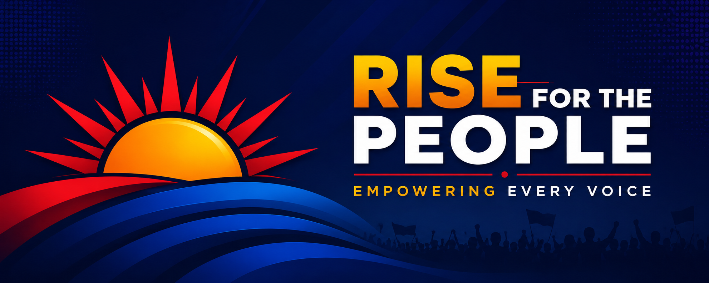

# United People's Front (UPF) — Official Repository

The official open-source codebase for the **United People's Front (UPF)** web site.

* 🌐 **Official Website:** [unitedpeoplefront.qzz.io](https://unitedpeoplefront.qzz.io/)
* 💌 **Donate:** [Donate page](https://unitedpeoplefront.qzz.io/donate) with an embedded Google Form

<p align="center">
  <a href="https://unitedpeoplefront.qzz.io" target="_blank">
    
  </a>
</p>

**Voice of the Unheard & Underserved.**

United People's Front is a youth-led civic movement built around awareness, accountability, local action, and satire. The current site keeps the same bold paper-and-ink visual language while presenting the UPF brand across the homepage, founder page, and donation page.

## Website Sections

### Hero
Opening section with the Community tagline, a rotating poster slideshow, and a compact stat grid.

### Vision
The movement's origin story and mission — building a people-first civic initiative rooted in local concerns.

### Manifesto
A five-point call for focused on local action, accountability, community responsibility, and environmental care.

### Eligibility
Four requirements for joining: Unemployed, Lazy, Chronically online, and the ability to rant professionally.

### SDGs
A dedicated section explaining how the movement maps to selected Sustainable Development Goals.

### Founder
A standalone founder page that keeps the same layout system, color palette, and visual tone as the rest of the site.

### Donate
An embedded Google Form page for donation-related contact and form submissions.

### Contact
Contact details, campaign poster, and an embedded Google Form-style contact experience.

## Routes

| Route | Description |
| ----- | ----------- |
| `/` | Main landing page with all sections |
| `/founder` | Founder page |
| `/donate` | Donate page with embedded Google Form |

## Socials

- **X / Twitter:** [@UPF4People](https://x.com/UPF4People)
- **Instagram:** [@upf4people](https://www.instagram.com/upf4people/)
- **Facebook:** [UPF Facebook](https://www.facebook.com/profile.php?id=61590512543442)
- **LinkedIn:** [United People's Front](https://www.linkedin.com/unitedpeoplesfront/)
- **Founder:** Ritesh Dutta (Founder & Convenor)

## Tech Stack

- **Framework:** [Next.js 16](https://nextjs.org/) (App Router, Turbopack)
- **Language:** TypeScript
- **Styling:** Tailwind CSS v4
- **Package Manager:** pnpm

## Getting Started

```bash
pnpm install
pnpm dev
```

Open [http://localhost:3000](http://localhost:3000) to view the site.

## Build

```bash
pnpm build
pnpm start
```

## Notes

- The site uses `public/banner.png`, `public/poster1.jpg`, and `public/poster21.jpg` for the major visual assets.
- The homepage content is synchronized with the current UPF branding and no longer references the older CJP petition flow or retired social links.
